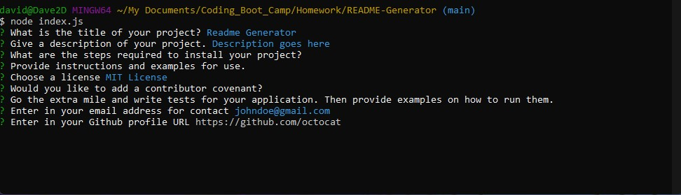

# Team-Profile-Generator

It is important to have a high-quality README for a given project. And this project allows a user to dynamically generate a professional README from the user's inputs. The user does not have to answer every prompt if the user chooses not to, and the table of contents will be generated based on whether not the user has answered the specific prompt or not. 

### Prerequisites

Open your command terminal and run 'npm install' in order to install the modules needed for this application to run properly. Then run 'node index.js' to start the application, and respond to the given prompts.

### Screenshots
Shown below is what the user will be prompted with when the user invokes this application

## Built With

* [HTML](https://developer.mozilla.org/en-US/docs/Web/HTML)
* [CSS](https://developer.mozilla.org/en-US/docs/Web/CSS)
* [Javascript](https://developer.mozilla.org/en-US/docs/Web/JavaScript)
* [NodeJS](https://nodejs.org/en/docs/)

## Authors

* **David Chou** 

- [Link to Portfolio Site](https://dazedchou.github.io/Updated-Portfolio)
- [Link to Github](https://github.com/dazedchou)
- [Link to LinkedIn](https://www.linkedin.com/in/davidchou99)

## License

This project is licensed under the MIT License 

